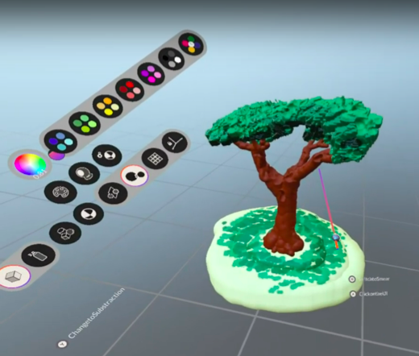

# Rooms


## An XR experience creation tool

**Rooms** is a platform for creating 3D content for XR experiences directly in XR-enabled hardware. XR interactive experiences require significant levels of expertise to curate across all stages of production and delivery. Rooms targets democratising the content creation process by lowering the barrier of entry for creating 3D assets to import into novel XR experiences. 

Through VR headsets, users could have the possibility to create full XR experiences involving 3D sculpted assets, 3D animations and scripted element behaviours.

<p align="center" width="100%">
     
</p>

## Current status

Rooms is currently in the development stages. 

### Roadmap

- [x] Web export (Still no XR enabled)
- [x] Flat screen + Desktop VR Rendering Supported
- [x] 3D SDF Sculpting in VR
- [x] Sparse SDF Storage and Evaluation solutions
- [x] Physically Based Materials (PBR)
- [ ] VR Color and Material Sculpt Painting
- [ ] Experience Generation
- [ ] Experience Sharing
- [ ] Skeletal Animation Editing in VR
- [ ] VR Animation Rigging
- [ ] Visual Scripting in VR
- [ ] Collaborative Experience Creation 
- [ ] WebXR Support (When available)

## How to build

You will need to install the following tools:

- [CMake](https://cmake.org/download/)
- [Python](https://www.python.org/) (added to your PATH)
- [Vulkan SDK](https://vulkan.lunarg.com/)

### Desktop

```bash
git submodule update --init --recursive
mkdir build
cd build
cmake ..
```

### Web


Download [emscripten](https://emscripten.org/) and follow the installation guide.


On Windows you may need to download [ninja](https://ninja-build.org/) and include the folder in your PATH environment variable, then:


```bash
git submodule update --init --recursive
mkdir build-web
cd build-web
emcmake cmake -DCMAKE_BUILD_TYPE=Release ..
cmake --build .
```

After building for web, you can host a local server with python:

```bash
python -m http.server
```

And access the webpage using a browser with WebGPU support using the link: ``localhost:8000/rooms.html``
